# Домашнее задание 2 и 3

_Теория формальных языков, ФПМИ МФТИ. Собрано автоматически скриптом compile_homework.py - правки вносить в исходные taskN/.../solution.md, а не в этот файл._

## Задача 1

### Пункт a)

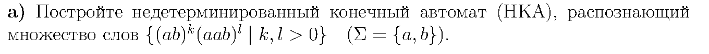

*Условие.*

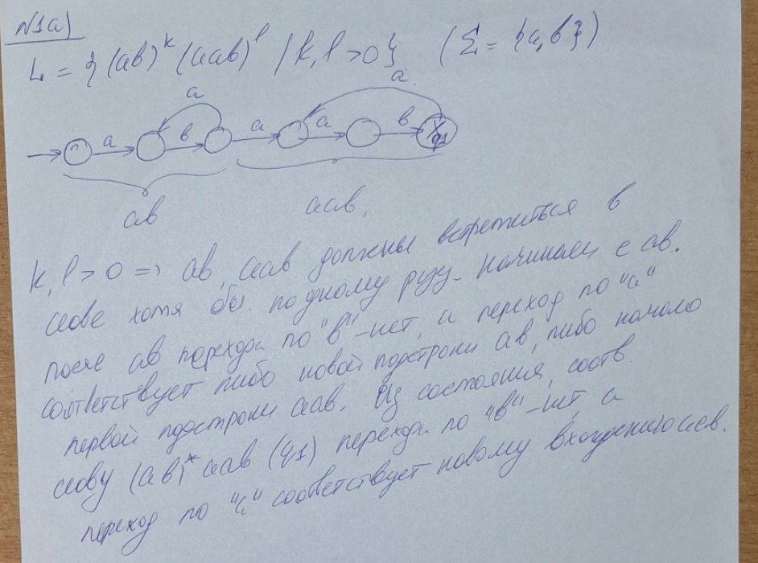

*Решение.*

### Пункт b)

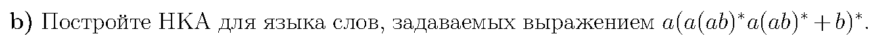

*Условие.*

##### Построим НКА

Регулярка та же, что дана в условии (и переиспользуется в задаче 2a для полного пайплайна НКА-ДКА-МДКА):

```
fslib automaton "a(a(ab)*a(ab)*|b)*" --out homeworks/hw2-hw3/task1/b/nfa.png
```


*НКА.*

### Пункт c)

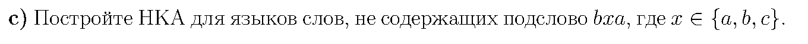

*Условие.*

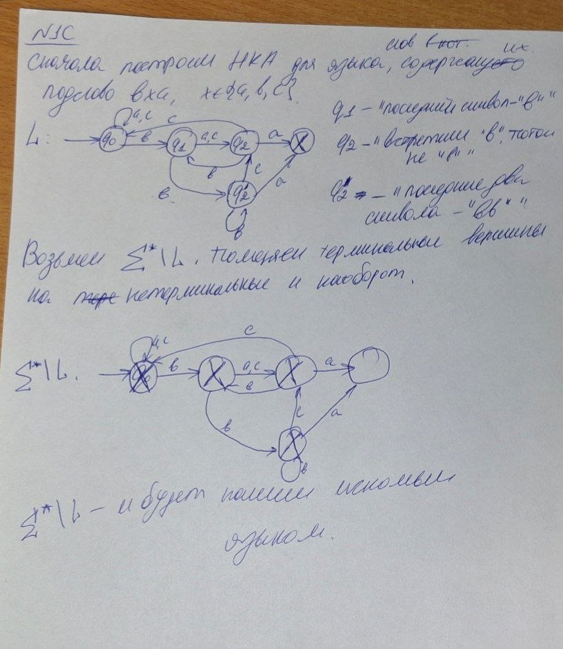

*Решение.*

## Задача 2

### Пункт a)

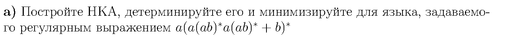

*Условие.*

##### Построение НКА

```
fslib automaton "a(a(ab)*a(ab)*|b)*" --out homeworks/hw2-hw3/task2/a/nfa.png
```

##### Построение ДКА

```
fslib dfa "a(a(ab)*a(ab)*|b)*" --out homeworks/hw2-hw3/task2/a/dfa.png
```

##### Построение МДКА

```
fslib min "a(a(ab)*a(ab)*|b)*" --out homeworks/hw2-hw3/task2/a/min.png
```

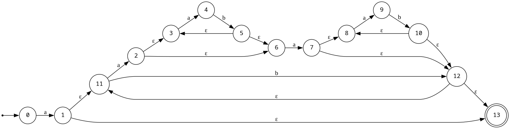

*НКА.*

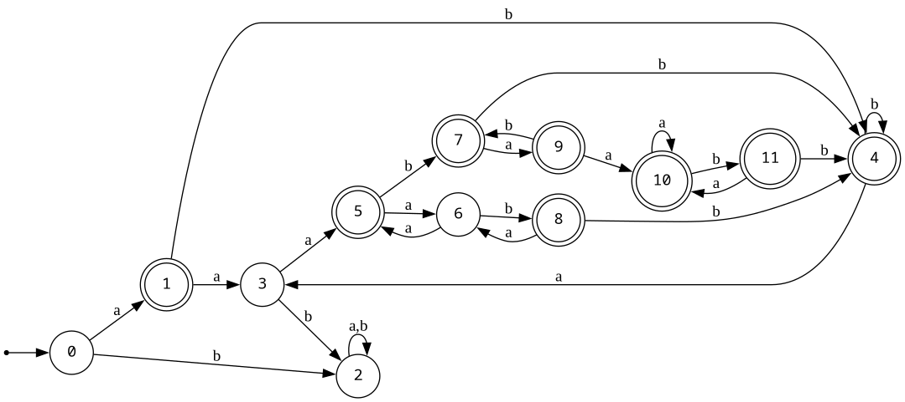

*ДКА.*

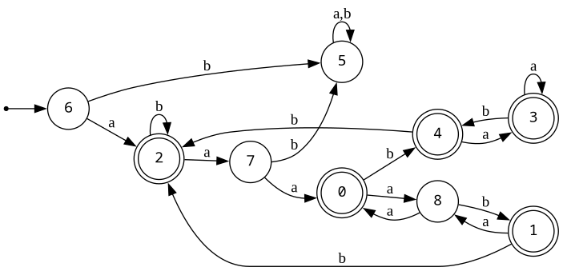

*Минимальный ДКА.*

### Пункт b)

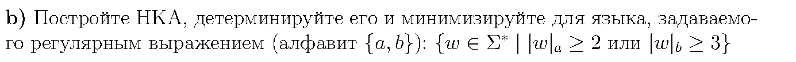

*Условие.*

##### Идея
Разбиваем язык на объединение двух стандартных шаблонов "хотя бы $k$ вхождений буквы":
$$L=L_1\cup L_2,\qquad L_1=\{w:|w|_a\ge2\},\quad L_2=\{w:|w|_b\ge3\}$$

##### Регулярка

```
.*a.*a.*|.*b.*b.*b.*
```

##### Построение НКА

```
fslib automaton ".*a.*a.*|.*b.*b.*b.*" --out homeworks/hw2-hw3/task2/b/nfa.png
```

##### Построение ДКА

```
fslib dfa ".*a.*a.*|.*b.*b.*b.*" --out homeworks/hw2-hw3/task2/b/dfa.png
```

##### Построение МДКА

```
fslib min ".*a.*a.*|.*b.*b.*b.*" --out homeworks/hw2-hw3/task2/b/min.png
```

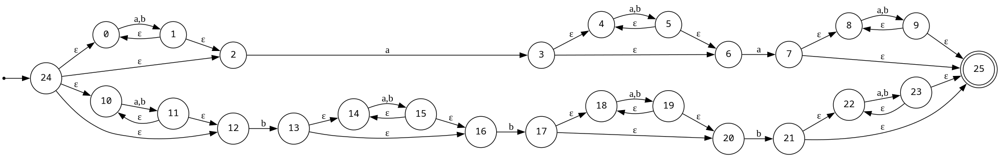

*НКА.*

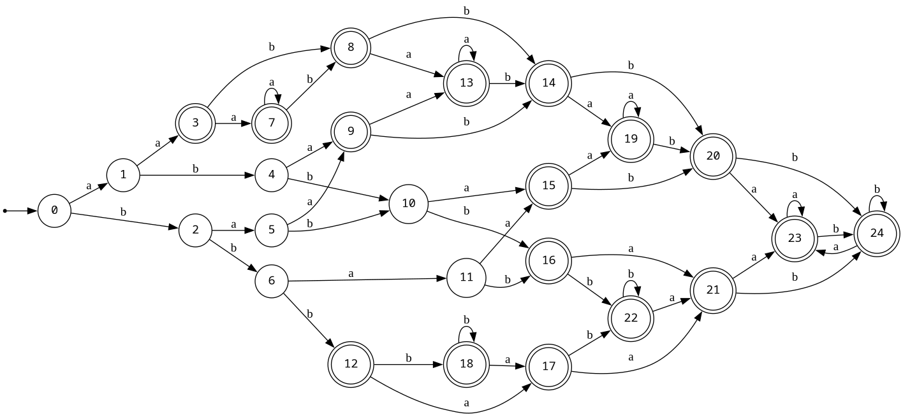

*ДКА.*

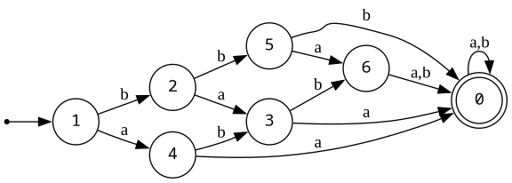

*Минимальный ДКА.*

### Пункт c)

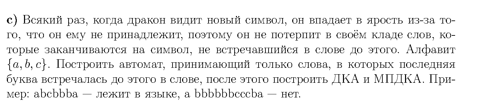

*Условие.*

##### Регулярка

То же условие, что в задаче 1c: слово годится, если оканчивается на букву, которая уже встречалась раньше. Формула
$$R=\Sigma^*a\Sigma^*a+\Sigma^*b\Sigma^*b+\Sigma^*c\Sigma^*c$$
требует, чтобы слово заканчивалось сразу вторым вхождением одной из букв, поэтому после второго $x$ никакого лишнего `.*` быть не должно:

```
.*a.*a|.*b.*b|.*c.*c
```

##### Построение НКА

```
fslib automaton ".*a.*a|.*b.*b|.*c.*c" --out homeworks/hw2-hw3/task2/c/nfa.png
```

##### Построение ДКА

```
fslib dfa ".*a.*a|.*b.*b|.*c.*c" --out homeworks/hw2-hw3/task2/c/dfa.png
```

##### Построение МДКА

```
fslib min ".*a.*a|.*b.*b|.*c.*c" --out homeworks/hw2-hw3/task2/c/min.png
```

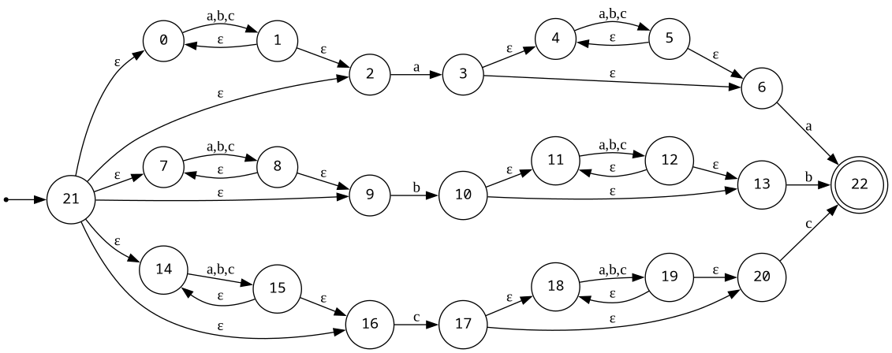

*НКА.*

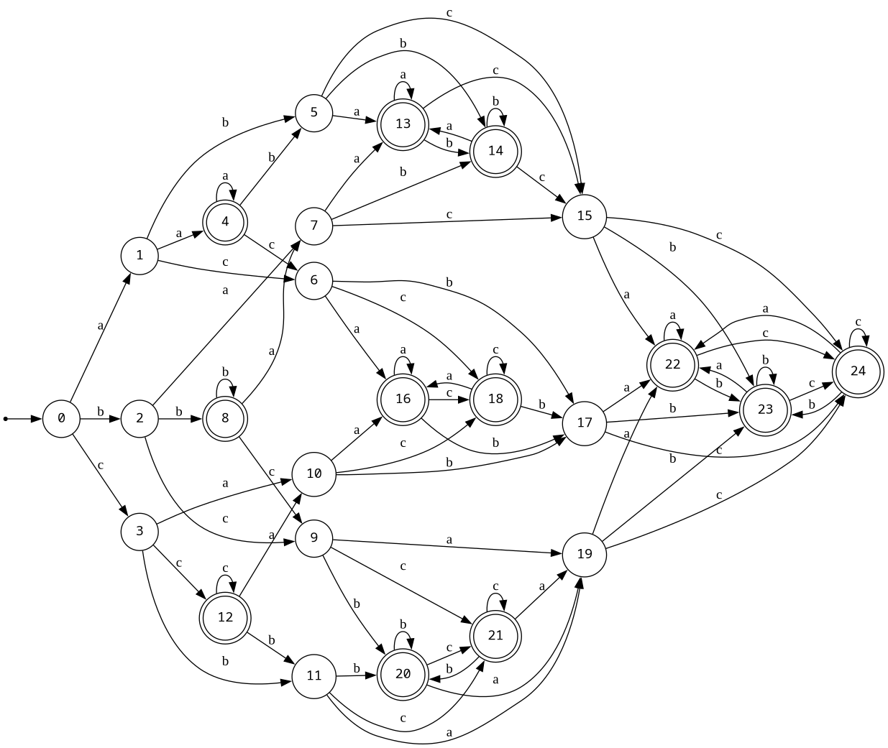

*ДКА.*

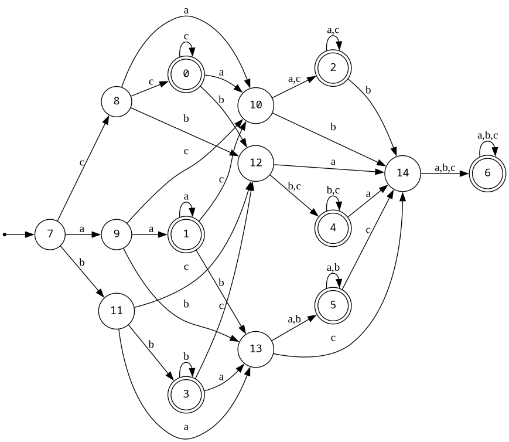

*Минимальный ДКА.*

## Задача 3

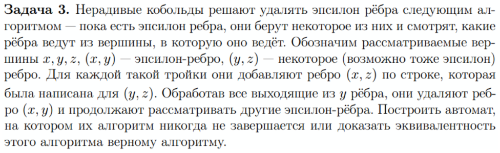

*Условие.*

#### Идея

Порядок выбора $\varepsilon$-рёбер нигде не оговорён, поэтому хватит одного примера, где какой-то допустимый порядок не останавливается. Опасен цикл из $\varepsilon$-рёбер: обработав одно ребро, мы тут же создаём новое такое же ребро, и его тоже придётся обрабатывать.

#### Контрпример на незавершаемость

Состояния 1, 2, 3, 4 (старт 1, финал 4), все рёбра - $\varepsilon$: $1\to2\to3\to4\to2$. Последнее ребро $4\to2$ замыкает цикл на состояниях 2, 3, 4.

Берём каждый раз $\varepsilon$-ребро, выходящее из 1:
1. $(1,2)$: из 2 выходит только ребро в 3, значит добавляем $(1,3)$ и удаляем $(1,2)$.
2. $(1,3)$: из 3 выходит только ребро в 4, добавляем $(1,4)$, удаляем $(1,3)$.
3. $(1,4)$: из 4 выходит только ребро в 2, добавляем $(1,2)$, удаляем $(1,4)$.

После третьего шага граф в точности такой же, как исходный, так что дальше всё пойдёт по кругу бесконечно. Рёбра самого цикла $2\to3\to4\to2$ за это время никто не трогал.

#### Вторая проблема алгоритма

Даже если он остановился, результат может быть неверным: алгоритм не делает $x$ финальным, когда $y$ финально. Возьмём состояния 0 и 1, ребро $0\xrightarrow{\varepsilon}1$, старт 0, финал 1 - язык $\{\varepsilon\}$. Алгоритм удаляет ребро $(0,1)$ (из 1 ничего не выходит) и получает автомат без единого ребра и без финальных состояний. Язык стал пустым - это неверно.

#### Как надо

Для каждого состояния $q$ строим $\varepsilon$-замыкание $E(q)$. Для каждого не-$\varepsilon$-ребра $r\xrightarrow{x}z$, где $r\in E(q)$, добавляем ребро $q\xrightarrow{x}z$; при этом $q$ объявляем финальным, если $E(q)\cap F\ne\varnothing$. Только после этого удаляем все $\varepsilon$-рёбра разом, а не по одному - тогда язык не меняется.

## Задача 4

### Пункт a)

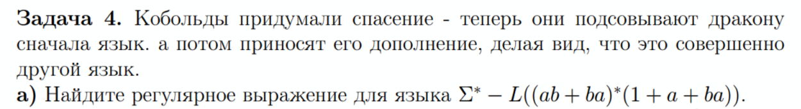

*Условие.*

##### Упрощение

Пусть $P=ab+ba$. Так как $ba$ и так лежит в $P$, слагаемое $P^*ba$ целиком содержится в $P^*$, поэтому исходный язык на самом деле равен $L_0=P^*(1+a)$: слово читается блоками по две буквы, каждый блок либо $ab$, либо $ba$, а в самом конце допускается одна лишняя буква $a$.

##### Разбор дополнения

Берём максимальный начальный кусок $p_1\ldots p_k\in P^*$, а остаток $r$ уже не начинается ни с $ab$, ни с $ba$. Возможны три случая:
- $r=\varepsilon$ или $r=a$ - слово лежит в $L_0$;
- $r=b$ - лишняя буква не $a$, слово в $L_0$ не попадает;
- $|r|\ge2$ - остаток начинается с $aa$ или $bb$, слово опять же не в $L_0$.

Разбиение слова на блоки однозначно, так что других вариантов нет:
$$\Sigma^*\setminus L_0=(ab+ba)^*\big((aa+bb)(a+b)^*+b\big).$$

##### Проверка через fslib

Переводим оба выражения в синтаксис библиотеки ($+$ это `|`, $1$ это пустая альтернатива в скобках):

```
fslib min "(ab|ba)*(|a|ba)" --out homeworks/hw2-hw3/task4/a/original-min.png
fslib complement "(ab|ba)*(|a|ba)" --out homeworks/hw2-hw3/task4/a/complement-min.png
fslib min "(ab|ba)*((aa|bb)(a|b)*|b)" --out homeworks/hw2-hw3/task4/a/answer-min.png
```

Оба минимальных автомата получаются на 4 состояниях. Прямое сравнение: взяли `complement()` от МДКА исходного языка и МДКА нашего ответа и сравнили `accepts(w)` на всех словах над $\{a,b\}$ длины до 14 (32767 слов) - расхождений нет, автоматы задают один и тот же язык.

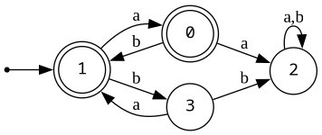

*МДКА исходного языка.*

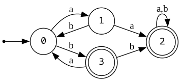

*МДКА дополнения (complement).*

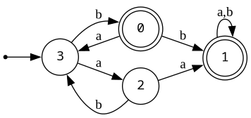

*МДКА полученного ответа.*

### Пункт b)

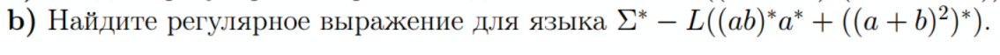

*Условие.*

##### Идея

Пусть $E=((a+b)^2)^*$ - все слова чётной длины. Так как $E$ целиком входит в исходный язык, в дополнении остаются только слова нечётной длины, и притом такие, что они не лежат в $(ab)^*a^*$.

Берём слово $w$ из дополнения и выделяем максимальный префикс $(ab)^k$, остаток $r$ уже не начинается с $ab$. Если $r\in a^*$, то $w\in(ab)^*a^*$ - такое слово не подходит. Значит в $r$ есть буква $b$: $r=a^j b s$, причём $j\ne1$ (иначе блок $ab$ вошёл бы в префикс). Из нечётности $|w|$ получаем, что $j+|s|$ чётно, и тут два случая:

- $j$ чётно ($0,2,\dots$) - тогда $s$ тоже должна быть чётной длины, то есть $s\in E$;
- $j$ нечётно и не меньше 3 - тогда $s$ нечётной длины, $s\in(a+b)E$.

$$\Sigma^*\setminus L=(ab)^*(aa)^*\big(b+aaab(a+b)\big)\big((a+b)^2\big)^*.$$

##### Проверка через fslib

Переводим оба выражения в синтаксис библиотеки ($+$ это `|`, $(a+b)^2$ это `(a|b)(a|b)`, повторов со степенью в грамматике нет):

```
fslib min "(ab)*a*|((a|b)(a|b))*" --out homeworks/hw2-hw3/task4/b/original-min.png
fslib complement "(ab)*a*|((a|b)(a|b))*" --out homeworks/hw2-hw3/task4/b/complement-min.png
fslib min "(ab)*(aa)*(b|aaab(a|b))((a|b)(a|b))*" --out homeworks/hw2-hw3/task4/b/answer-min.png
```

Оба минимальных автомата получаются на 6 состояниях. Сравнили `complement()` от МДКА исходного языка с МДКА нашего ответа на всех словах над $\{a,b\}$ длины до 15 (65535 слов) - расхождений нет.

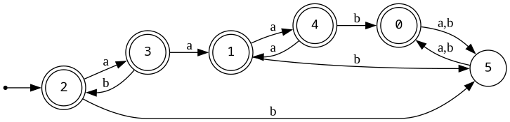

*МДКА исходного языка.*

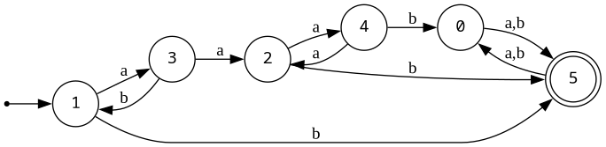

*МДКА дополнения (complement).*

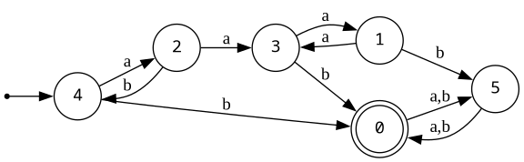

*МДКА полученного ответа.*

## Задача 5

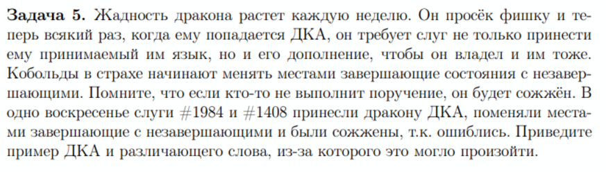

*Условие.*

#### Идея

Обмен статусов даёт дополнение только для полного ДКА. Если каких-то переходов не хватает, слово может просто оборваться на середине - а отсутствие перехода это то же самое, что неявный переход в сток, который никогда не финальный. После обмена статусов сток должен был бы стать финальным, но раз его в автомате нет явно, все оборвавшиеся слова так и остаются отвергнутыми.

#### Контрпример

$M$: одно состояние 0 (оно же старт и финал), петля по $a$, перехода по $b$ нет. $L(M)=a^*$.

После наивного обмена состояние 0 становится нефинальным, других состояний нет, значит $L(M')=\varnothing$. Но $\Sigma^*\setminus a^*$ содержит, например, слово $b$ - оно должно приниматься дополнением. На деле его не принимает ни $M$ (перехода нет), ни $M'$ (перехода всё так же нет, да и состояние стало нефинальным). Различающее слово - просто $b$.

#### Исправление

Сначала автомат нужно достроить до полного: добавить нефинальный сток $S_\varnothing$ и провести туда все недостающие переходы, включая петлю $S_\varnothing\xrightarrow{a,b}S_\varnothing$, и только после этого менять местами финальные и нефинальные состояния. Тогда $S_\varnothing$ станет финальным, и слово $b$, которое как раз в него и ведёт, будет принято правильно.

## Задача 6

### Пункт a)

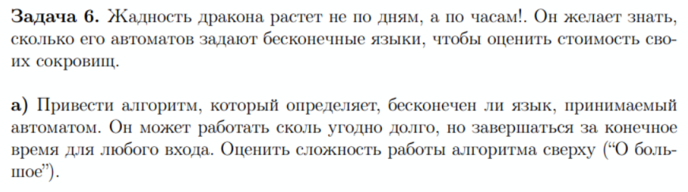

*Условие.*

##### Критерий

Язык бесконечен тогда и только тогда, когда на каком-то пути от старта до финала есть цикл, на котором читается хотя бы одна буква (цикл из одних $\varepsilon$-рёбер слово не удлиняет, так что он не считается).

##### Алгоритм, время $O(|Q|+|E|)$

1. Обходом в ширину от старта находим множество достижимых состояний $R$.
2. Обходом в ширину по обращённым рёбрам от финальных состояний находим множество $T$ - состояния, из которых финал ещё достижим.
3. Оставляем только полезные состояния $R\cap T$ и рёбра между ними: любой принимающий путь целиком лежит в этой части графа.
4. Разбиваем то, что осталось, на компоненты сильной связности (алгоритмом Косарайю).
5. Если внутри хотя бы одной компоненты есть ребро с буквой (не $\varepsilon$), язык бесконечен, иначе конечен.

##### Почему это верно

Если в компоненте нашлось помеченное ребро, оно лежит на цикле из полезных состояний, а значит существует путь старт, потом сколько угодно раз по циклу, потом до финала - для любого числа повторов. Длины таких слов растут без ограничения, язык бесконечен.

Если же ни в одной компоненте помеченных рёбер нет, стянём каждую компоненту в точку - получится граф без циклов. Принимающий путь пересекает границы компонент не больше $|Q|-1$ раз, а буквы читаются только на этих межкомпонентных рёбрах, значит все принимаемые слова короче $|Q|$ и их конечное число.

Оба обхода и алгоритм Косарайю работают за $O(|Q|+|E|)$.

### Пункт b)

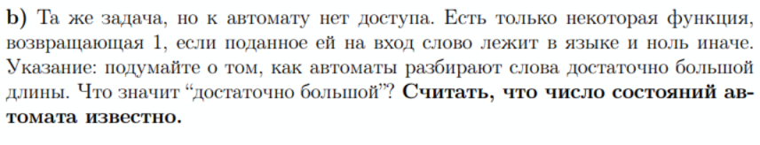

*Условие.*

##### Идея (накачка)

Если принято слово длины хотя бы $n$, путь по нему проходит не меньше $n+1$ состояний, значит какое-то состояние повторяется, а между повторами лежит цикл $y$ длиной $1\le|y|\le n$, который можно накачивать - язык бесконечен. Слов короче $n$ конечное число, так что весь вопрос сводится к тому, найдётся ли в языке достаточно длинное слово.

Такое слово, если оно вообще есть, найдётся уже среди слов длины от $n$ до $2n-1$. Пусть $w=xyz$ - кратчайшее принятое слово длины $\ge n$ и при этом $|w|\ge2n$. Тогда $xz$ тоже принимается (цикл $y$ просто выкидывается), и $|xz|=|w|-|y|\ge|w|-n\ge n$: слово $xz$ всё ещё длины не меньше $n$, но короче $w$. Это противоречит тому, что $w$ было кратчайшим, значит на самом деле $|w|<2n$, то есть $n\le|w|\le2n-1$.

##### Алгоритм

Перебираем все слова длины от $n$ до $2n-1$ над $\Sigma$ и вызываем на них $f$. Если хоть одно принято, язык бесконечен, иначе конечен.

##### Сложность

$$\sum_{k=n}^{2n-1}|\Sigma|^k=O\big(|\Sigma|^{2n}\big)\quad(|\Sigma|\ge2),$$
а при $|\Sigma|=1$ вызовов будет ровно $n$.

##### Проверка

`verify.py` берёт два игрушечных автомата (роль оракула $f$ играет их `accepts`) и прогоняет через них алгоритм: язык $\{ab\}$ на 3 состояниях (конечный) и язык $a(ba)^*$ на 3 состояниях (бесконечный).

```
python3 homeworks/hw2-hw3/task6/b/verify.py
```

```
finite {ab} -> False
infinite a(ba)* -> True
```

Оба ответа верные.

## Задача 8

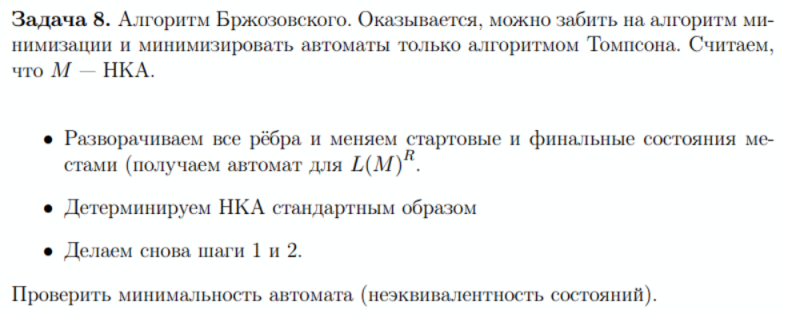

*Условие.*

#### Обозначения

$D$ - ДКА после первого разворота и детерминизации (он распознаёт $L(M)^R$). $D^R$ - разворот $D$. $N$ - итоговый автомат после второго разворота и детерминизации.

#### Язык сохраняется

Разворот рёбер читает слово задом наперёд, а детерминизация язык не меняет. Значит $L(D)=L(M)^R$, а $L(N)=L(D^R)=L(D)^R=L(M)$.

#### Почему $N$ минимален

Во-первых, все состояния $D$ достижимы - их и строит обход в ширину при детерминизации, состояние в автомат попадает только тогда, когда до него дошли из старта. Значит для каждого состояния $q$ автомата $D$ найдётся слово $w_q$, по которому $D$ из старта попадает ровно в $q$ и никуда больше (это детерминированный автомат). Ровно та же логика работает и для $N$ на шаге 4: он тоже строится обходом в ширину от начального подмножества, так что все его состояния достижимы.

Во-вторых, состояния $N$ попарно различимы. Состояния $N$ - это подмножества состояний $D$. Возьмём два разных, $S$ и $T$, и состояние $q\in S\setminus T$. В $D^R$ слово $w_q^R$ ведёт из $q$ в старт автомата $D$, а этот старт как раз финален в $D^R$ - значит из $S$ слово $w_q^R$ принимается. Из $T$ оно не принимается: иначе в $D$ нашёлся бы путь из старта в $T$ по слову $w_q$, но мы знаем, что $D$ по $w_q$ из старта приходит именно в $q$, а не в $T$. Значит $w_q^R$ различает $S$ и $T$.

Раз состояния $N$ достижимы и попарно различимы, они соответствуют разным классам Майхилла-Нероуда, а значит $N$ и есть минимальный ДКА для $L(M)$. Если нужен ещё и полный МДКА (в том смысле, что в задаче 2), нефинальный сток достраивается отдельным шагом, как в задаче 5.

#### Пример: $L=(a+b)^*ab$

НКА $M$: состояние 0 с петлёй по $a$ и $b$, дальше $0\xrightarrow{a}1\xrightarrow{b}2$; старт 0, финал 2.

Разворот даёт язык $ba(a+b)^*$: $2\xrightarrow{b}1\xrightarrow{a}0$, петля $0$ по $a,b$; старт 2, финал 0. У состояния 2 нет перехода по $a$, у состояния 1 нет перехода по $b$ - при детерминизации это даст мёртвое состояние.

Детерминизация строит $D$ обходом от $s_0=\{2\}$: по $b$ он идёт в $s_1=\{1\}$, а по $a$ - в пустое множество $s_\varnothing$ (перехода нет). Дальше $s_1$ по $a$ идёт в $s_2=\{0\}$, а по $b$ - снова в $s_\varnothing$. Состояние $s_2$ финально и зациклено само на себя по $a,b$; $s_\varnothing$ тоже зациклено само на себя и никуда, кроме себя, не ведёт.

Разворачиваем $D$: старт становится $s_2$, финал - $s_0$, и в развороте $s_\varnothing$ оказывается недостижим из $s_2$ (в него можно попасть только из $s_0$ и $s_1$ по обращённым рёбрам, а до них ещё нужно дойти). Детерминизируем второй раз, отбрасывая недостижимое, и получаем $N$: $X_0\xrightarrow{a}X_1\xrightarrow{b}X_2\xrightarrow{a}X_1$, где $X_2$ финально, плюс петли $X_0\xrightarrow{b}X_0$, $X_1\xrightarrow{a}X_1$ и переход $X_2\xrightarrow{b}X_0$.

Это ровно знакомый минимальный автомат для условия "слово заканчивается на $ab$": $X_0$ значит "не заканчивается ни на $a$, ни на $ab$", $X_1$ значит "заканчивается на $a$", $X_2$ значит "заканчивается на $ab$". Все три состояния различимы, например словом $b$: из $X_0$ оно ведёт обратно в $X_0$, а из $X_1$ - в финальное $X_2$.
